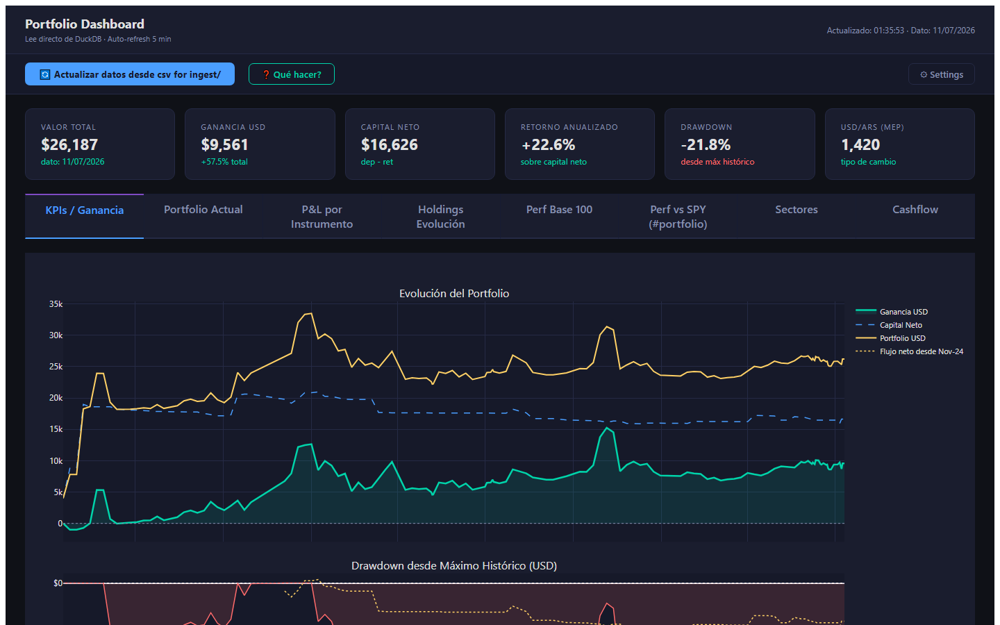
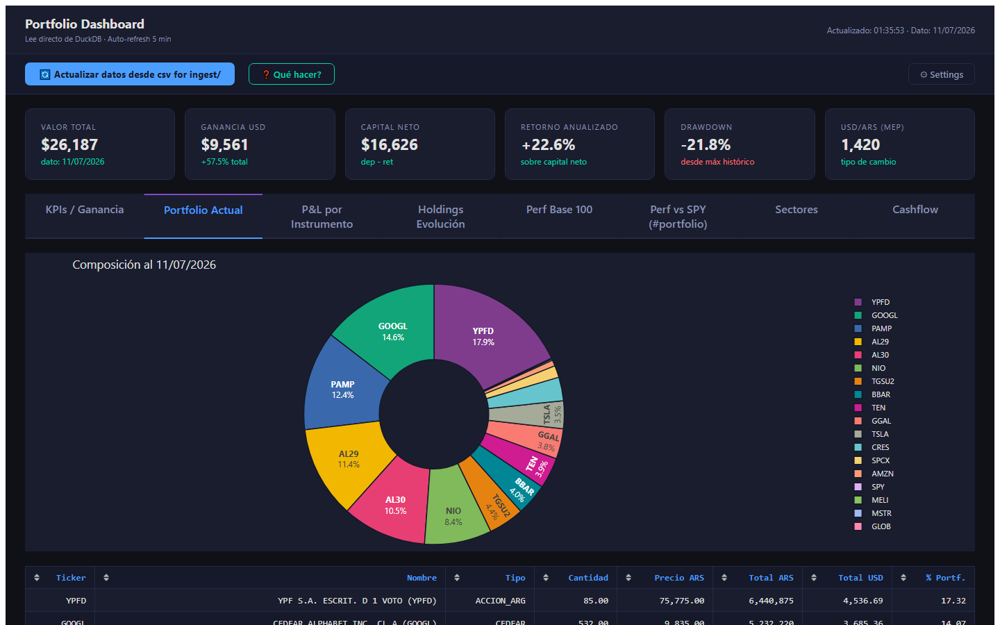
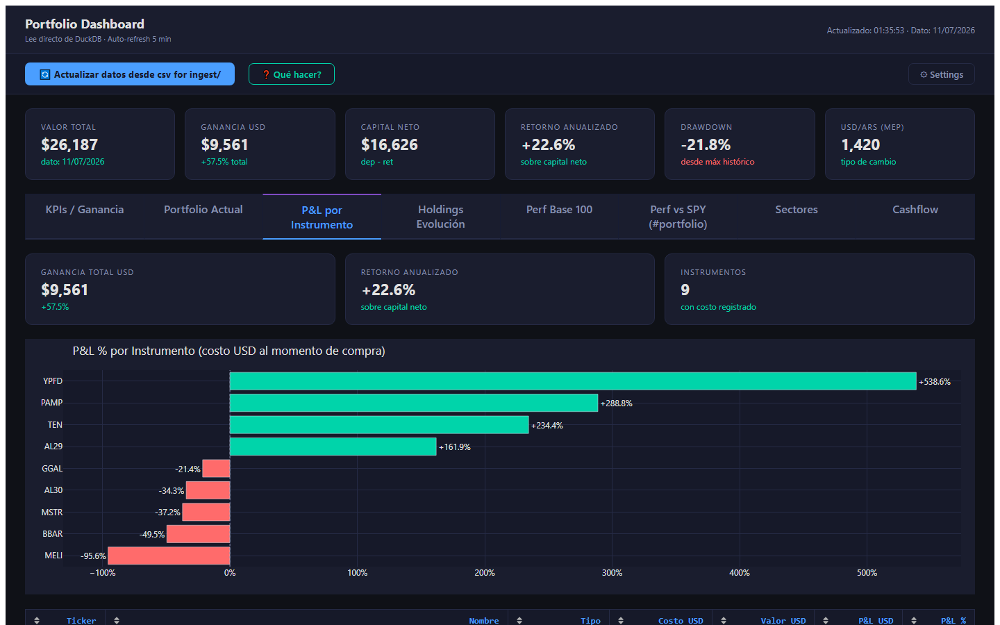
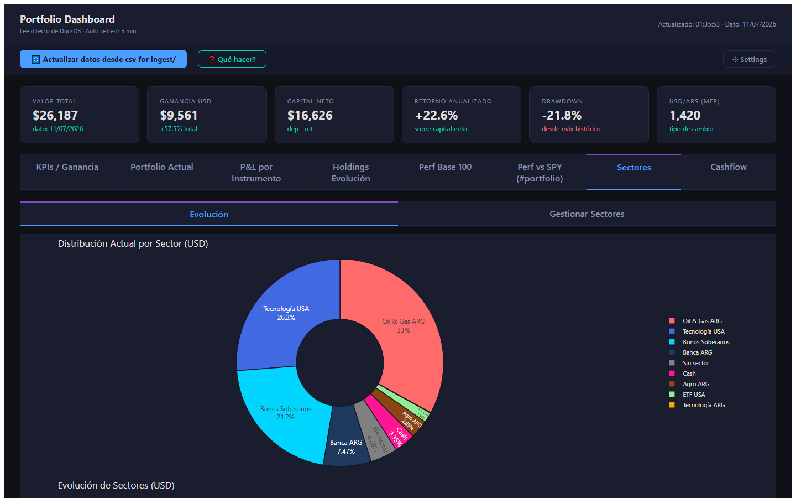

# Cocos Portfolio Tracker

Dashboard local de gestión de portafolio para cuentas de COCOS Capital. Corre completamente en tu máquina — sin nube, sin servicios externos.

Construido con Python, Dash, Plotly y DuckDB.



---

## Por qué existe este proyecto

COCOS Capital ofrece una buena plataforma de brokerage, pero sus reportes integrados son limitados para analizar el portafolio a lo largo del tiempo. Las alternativas obvias — trackers de terceros, integraciones con el broker, o pulls automáticos de datos — requieren una API key o acceso OAuth a tu cuenta. Eso significa darle a un servicio externo acceso de lectura (o más) a tus posiciones, transacciones y saldo.

Este proyecto toma un camino diferente: **exportás los CSVs manualmente desde COCOS y los tirás en una carpeta**. La app lee esos archivos, los carga en una base de datos DuckDB local, y sirve un dashboard completo de análisis en tu propia máquina. Sin API keys. Sin conexiones externas. Sin servicios que puedan ser comprometidos o cambiar sus términos.

Tus datos nunca salen de tu computadora.

---

## Capturas de pantalla

### KPIs / Evolución del Portfolio


### Composición del Portfolio


### P&L por Instrumento


### Desglose por Sector


---

## Instalación

### Requisitos previos

- Python 3.11 o superior — descargar desde [python.org/downloads](https://www.python.org/downloads/)
  - Durante la instalación: marcar ✅ **"Add Python to PATH"**
- Git — descargar desde [git-scm.com](https://git-scm.com)

### Pasos

```bash
# 1. Clonar el repositorio
git clone https://github.com/kindmartin/cocos-portfolio-tracker
cd cocos-portfolio-tracker

# 2. Crear entorno virtual
python -m venv .venv

# 3. Activar (Windows)
.venv\Scripts\activate

# 4. Instalar dependencias
pip install -r requirements.txt

# 5. Inicializar base de datos vacía
python code/setup_db.py

# 6. Lanzar
python QUICKSTART.py
```

Abrir el navegador en **http://localhost:8050**

> La base de datos y los CSVs con datos personales **no están incluidos** en el repositorio. Cada usuario trabaja con sus propios datos.

---

## Cómo cargar tus datos

1. Exportá los reportes de posición y el historial de movimientos desde COCOS
2. Copiá los archivos CSV a la carpeta `csv for ingest/`
3. Hacé click en **"Actualizar datos desde csv for ingest/"** en el dashboard, o ejecutá:

```bash
python code/etl.py
```

El sistema detecta automáticamente si cada archivo es un snapshot de posiciones o un listado de transacciones, lo mueve a la carpeta correcta y lo carga en la base de datos.

---

## Estructura del proyecto

```
cocos-portfolio-tracker/
├── code/
│   ├── portfolio_dashboard.py   # App web principal (Dash)
│   ├── setup_db.py              # Inicializar schema DuckDB
│   ├── etl.py                   # Cargar CSVs a la base de datos
│   ├── ingest_monitor.py        # Monitoreo automático de csv for ingest/
│   ├── ingest_api.py            # API REST para control de ingestión
│   ├── sector_manager.py        # Lógica de asignación de sectores
│   └── launcher_main.py         # Menú de lanzador avanzado
├── csv for ingest/              # Depositar nuevos CSVs aquí
├── data/
│   └── db/                      # Base de datos DuckDB (no incluida en repo)
├── QUICKSTART.py                # Lanzador recomendado para nuevos usuarios
├── requirements.txt
└── docs/
    └── README.md
```

---

## Lanzadores disponibles

| Comando | Descripción |
|---|---|
| `python QUICKSTART.py` | Menú interactivo — recomendado para nuevos usuarios |
| `python code/launcher_main.py` | Menú completo con ETL, monitor, API, herramientas |
| `python code/portfolio_dashboard.py` | Lanzar dashboard directo en puerto 8050 |
| `python code/portfolio_dashboard.py --port 8080` | Puerto personalizado |

---

## Troubleshooting

**"DB no encontrada"**
```bash
python code/setup_db.py
python code/etl.py
```

**Puerto 8050 en uso**
```bash
python code/portfolio_dashboard.py --port 8080
```

**"DuckDB version mismatch"**
```bash
pip install --upgrade duckdb
```

**"No se pudo detectar tipo de CSV"**
- Verificar que el archivo tenga las columnas estándar de COCOS (`instrumento` o `fechaejecucion`)
- El encoding debe ser UTF-8
- Ver detalle del error en `data/ingest_errors/`

---

## Stack tecnológico

| Capa | Librería |
|---|---|
| Interfaz web | [Dash](https://dash.plotly.com) 2.18+ |
| Gráficos | [Plotly](https://plotly.com/python) 6.0+ |
| Base de datos | [DuckDB](https://duckdb.org) 1.0+ |
| Procesamiento de datos | [pandas](https://pandas.pydata.org) 2.2+ |
| API de ingestión | [Flask](https://flask.palletsprojects.com) 3.0+ |

---

## Licencia

MIT
