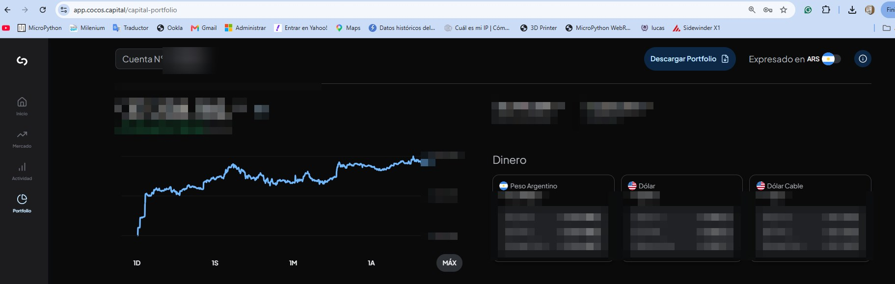
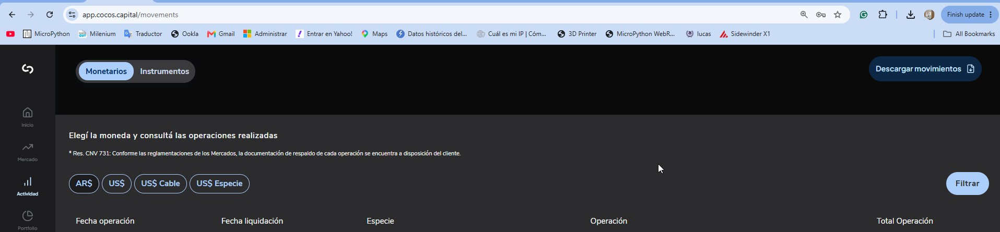

# Cocos Portfolio Tracker

> 🇦🇷 [Versión en español](README.es.md)

Local portfolio management dashboard for COCOS brokerage accounts. Runs entirely on your machine — no cloud, no data sharing.

Built with Python, Dash, Plotly and DuckDB.

---

## Why this exists

COCOS Capital provides a solid brokerage platform, but its built-in reporting is limited for portfolio analysis over time. The obvious alternatives — third-party portfolio trackers, broker integrations, or automated data pulls — all require either an API key or OAuth access to your brokerage account. That means granting an external service read (or more) access to your positions, transactions, and account balance.

This project takes a different approach: **you export the CSVs manually from COCOS and drop them into a folder**. The app reads those files, loads them into a local DuckDB database, and serves a full analytics dashboard on your own machine. No API keys. No external connections. No service that could be compromised or change its terms.

Your data never leaves your computer.


---

## Features

- **KPIs in real time** — total value, profit/loss, annualized return, drawdown, USD/ARS rate
- **Portfolio composition** — donut chart by instrument with holdings table
- **P&L by instrument** — bar chart showing % gain/loss per position
- **Holdings evolution** — track how each position grew over time
- **Base 100 performance** — normalized return curve from your start date
- **vs SPY comparison** — your portfolio vs S&P 500 benchmark
- **Sector breakdown** — allocation and evolution by sector
- **Cashflow** — deposits, withdrawals and net capital over time
- **Automatic CSV ingest** — drop a file, the app detects type and loads it
- **Auto-refresh** every 5 minutes

---

## Screenshots

### KPIs / Portfolio Evolution


### Portfolio Composition


### P&L by Instrument


### Sector Breakdown


---

## Installation

### Requirements

- Python 3.11 or higher — download from [python.org/downloads](https://www.python.org/downloads/)
  - During install: check **"Add Python to PATH"**
- Git — download from [git-scm.com](https://git-scm.com)

### Steps

```bash
# 1. Clone the repository
git clone https://github.com/kindmartin/cocos-portfolio-tracker
cd cocos-portfolio-tracker

# 2. Create virtual environment
python -m venv .venv

# 3. Activate (Windows)
.venv\Scripts\activate

# 4. Install dependencies
pip install -r requirements.txt

# 5. Initialize empty database
python code/setup_db.py

# 6. Launch
python QUICKSTART.py
```

Open your browser at **http://localhost:8050**

> Your database and personal CSV files are **not included** in this repo. Each user works with their own data.

---

## Loading your data

### Step 1 — Export CSVs from COCOS

The app works with two file types that you export manually from [cocos.capital](https://cocos.capital):

#### Portfolio snapshot
Shows the value of each instrument on a given date.

1. Log in to **[app.cocos.capital/capital-portfolio](https://app.cocos.capital/capital-portfolio)**
2. Click the **"Descargar Portfolio"** button (top right)
3. File downloads as: `portfolio_report_YYYYMMDD.csv`



> Do this periodically (weekly or monthly) to build a history of your portfolio evolution.

#### Account movements (transactions)
Purchases, sales, deposits, withdrawals and other movements.

1. Log in and go to **[app.cocos.capital/movements](https://app.cocos.capital/movements)**
2. Select the currency tab (ARS, US$, etc.) and filter the period if needed
3. Click **"Descargar movimientos"** (top right)
4. File downloads as: `movimientos_cuenta YYYY.csv`



---

### Step 2 — Drop the files into the ingest folder

Copy the downloaded files to:

```
cocos-portfolio-tracker/
└── csv for ingest/          ← drop CSVs here
```

Both file types can be placed in the same folder at the same time — the app detects each type automatically from its columns.

---

### Step 3 — Process

**Option A — From the dashboard:**
Click **"Actualizar datos desde csv for ingest/"**

**Option B — From the terminal:**
```bash
python code/etl.py
```

**Useful flags:**
```bash
python code/etl.py --snapshots      # Only load snapshots
python code/etl.py --transactions   # Only load transactions
python code/etl.py --force          # Force reload even if already loaded
python code/etl.py --reset          # Wipe and reload everything from scratch
```

After processing, files are moved automatically to `data/processed csv/`. On error, the file stays in `data/ingest_errors/` with a `.error` file explaining what went wrong.

---

## Project structure

```
cocos-portfolio-tracker/
├── code/
│   ├── portfolio_dashboard.py   # Main Dash web app
│   ├── setup_db.py              # Initialize DuckDB schema
│   ├── etl.py                   # Load CSVs into database
│   ├── ingest_monitor.py        # Auto-watch csv for ingest/ folder
│   ├── ingest_api.py            # REST API for ingest control
│   ├── sector_manager.py        # Sector assignment logic
│   └── launcher_main.py         # Advanced launcher menu
├── csv for ingest/              # Drop new CSVs here
├── data/
│   └── db/                      # DuckDB database (not in repo)
├── QUICKSTART.py                # Beginner-friendly launcher
├── requirements.txt
└── docs/
    └── README.md
```

---

## Launchers

| Command | Description |
|---|---|
| `python QUICKSTART.py` | Interactive menu — recommended for new users |
| `python code/launcher_main.py` | Full menu with ETL, monitor, API, tools |
| `python code/portfolio_dashboard.py` | Launch dashboard directly on port 8050 |
| `python code/portfolio_dashboard.py --port 8080` | Custom port |

---

## Troubleshooting

**"DB not found"**
```bash
python code/setup_db.py
python code/etl.py
```

**Port 8050 already in use**
```bash
python code/portfolio_dashboard.py --port 8080
```

**DuckDB version mismatch**
```bash
pip install --upgrade duckdb
```

---

## Tech stack

| Layer | Library |
|---|---|
| Web UI | [Dash](https://dash.plotly.com) 2.18+ |
| Charts | [Plotly](https://plotly.com/python) 6.0+ |
| Database | [DuckDB](https://duckdb.org) 1.0+ |
| Data processing | [pandas](https://pandas.pydata.org) 2.2+ |
| Ingest API | [Flask](https://flask.palletsprojects.com) 3.0+ |

---

## License

MIT
